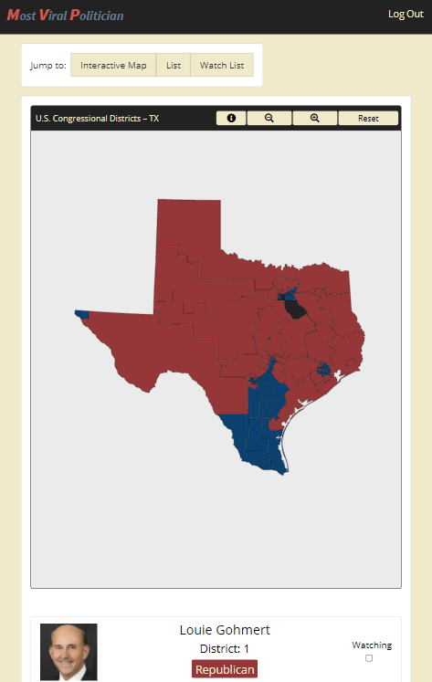
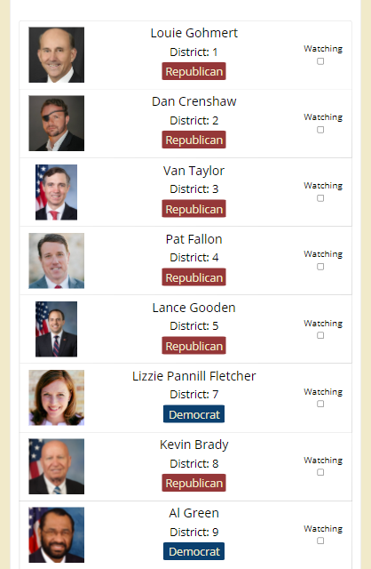
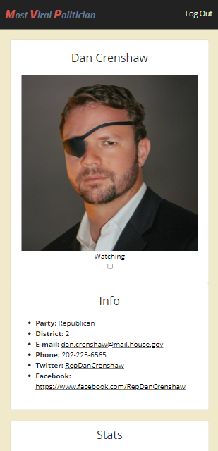

&emsp; &emsp;&emsp;&emsp;&emsp;&emsp;&emsp;&emsp;&emsp;&emsp;&emsp;&emsp;&emsp;&emsp;&emsp;&emsp;&emsp;&emsp;&emsp;&emsp; ***Most Viral Politician*** 

___

  

    
  
  
  

  
  
  
  
  
  
   
  
  
  
     
  
  
  
  

___

<h3 align="center">
  <a href="#information_source-about">About</a>&nbsp;|&nbsp;
  <a href="#seedling-requirements-to-use">Requirements To Use</a>&nbsp;|&nbsp;
  <a href="#rocket-technologies">Technologies Used</a>&nbsp;|&nbsp;
  <a href="#link-contributing">How To Contribute</a>&nbsp;|&nbsp;
  <a href="#license">License</a>
</h3>

___

## :information_source: About

The site facilitates access to information about the congressmen and congresswomen of Texas.  
### *** ***Site is functional. Enhancements in progress.*** *** ### 
 

## :seedling: Requirements To Use
Simply Click -->
https://most-viral-politician.herokuapp.com/

## :rocket: Technologies 

The project was created using the following technologies:

- NodeJS
- Bootstrap
- React Framework
- CSS
- Firebase Authentication
- Cloud Firestore (NoSQL Database)
- Mongoose
- SVG Map
- MongoDB
- Custom Python Information-Scraping Scripts
- *** All npm packages can be seen in package.json ***

## :link: Contributing 

- Fork the repository
- Clone it to your local machine
- Create a branch with your new feature
- Add, commit, and push your changes to your branch
- Create a pull request on this project with your branch changes

## License 

This project is using an MIT license. Click here [LICENSE](LICENSE) for more details.

### Contributors
Jose Rivera : https://github.com/sournachos  
Matt Parker : https://github.com/mattyp1007  
Hamza Sait : https://github.com/hamzsait  
Matthew Bohl : https://github.com/mattjb97  
